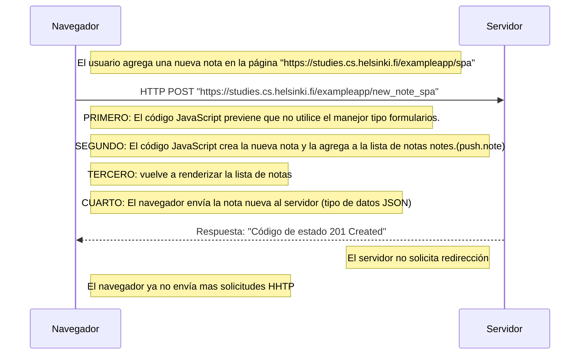

```mermaid
sequenceDiagram
Participant Navegador
Participant Servidor

Note right of Navegador: El usuario agrega una nueva nota en la página "https://studies.cs.helsinki.fi/exampleapp/spa"
Navegador ->>  Servidor: HTTP POST "https://studies.cs.helsinki.fi/exampleapp/new_note_spa"
Note right of Navegador: PRIMERO: El código JavaScript previene que no utilice el manejor tipo formularios. 
Note right of Navegador: SEGUNDO: El código JavaScript crea la nueva nota y la agrega a la lista de notas notes.(push.note)
Note right of Navegador: TERCERO: vuelve a renderizar la lista de notas
Note right of Navegador: CUARTO: El navegador envía la nota nueva al servidor (tipo de datos JSON)

Servidor -->> Navegador: Respuesta: "Código de estado 201 Created"
Note left of Servidor: El servidor no solicita redirección
Note right of Navegador: El navegador ya no envía mas solicitudes HHTP


```
