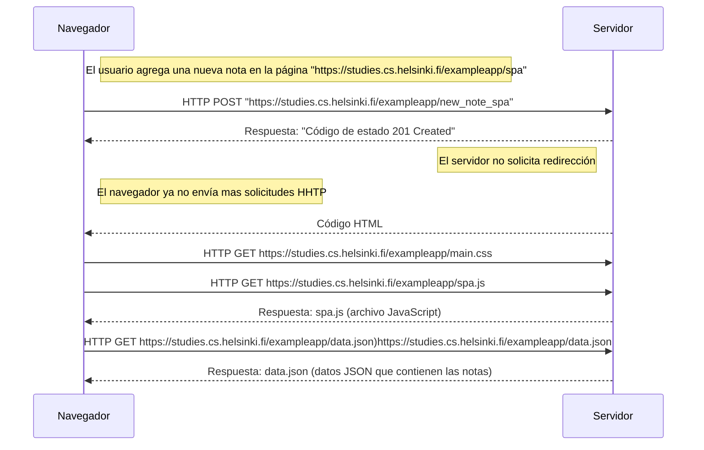

```mermaid
sequenceDiagram
Participant Navegador
Participant Servidor

Note right of Navegador: El usuario agrega una nueva nota en la página "https://studies.cs.helsinki.fi/exampleapp/spa"
Navegador ->>  Servidor: HTTP POST "https://studies.cs.helsinki.fi/exampleapp/new_note_spa"
Servidor -->> Navegador: Respuesta: "Código de estado 201 Created"
Note left of Servidor: El servidor no solicita redirección
Note right of Navegador: El navegador ya no envía mas solicitudes HHTP


Servidor -->> Navegador: Código HTML
Navegador ->>  Servidor: HTTP GET https://studies.cs.helsinki.fi/exampleapp/main.css
Navegador ->>  Servidor:  HTTP GET https://studies.cs.helsinki.fi/exampleapp/spa.js
Servidor -->> Navegador: Respuesta: spa.js (archivo JavaScript)
Navegador ->>  Servidor: HTTP GET https://studies.cs.helsinki.fi/exampleapp/data.json)https://studies.cs.helsinki.fi/exampleapp/data.json
Servidor -->> Navegador: Respuesta: data.json (datos JSON que contienen las notas)


```
