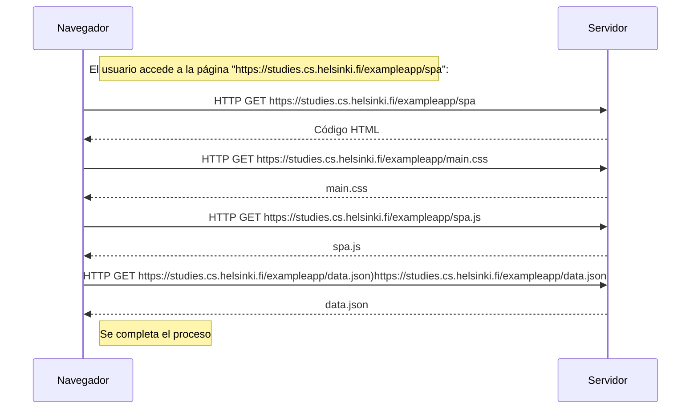

```mermaid
sequenceDiagram
Participant Navegador
Participant Servidor

Note right of Navegador: El usuario accede a la página "https://studies.cs.helsinki.fi/exampleapp/spa":
Navegador ->>  Servidor: HTTP GET https://studies.cs.helsinki.fi/exampleapp/spa
Servidor -->> Navegador: Código HTML
Navegador ->>  Servidor: HTTP GET https://studies.cs.helsinki.fi/exampleapp/main.css
Servidor -->> Navegador: main.css
Navegador ->>  Servidor:  HTTP GET https://studies.cs.helsinki.fi/exampleapp/spa.js
Servidor -->> Navegador: spa.js
Navegador ->>  Servidor: HTTP GET https://studies.cs.helsinki.fi/exampleapp/data.json)https://studies.cs.helsinki.fi/exampleapp/data.json
Servidor -->> Navegador: data.json

Note right of Navegador: Se completa el proceso

```
