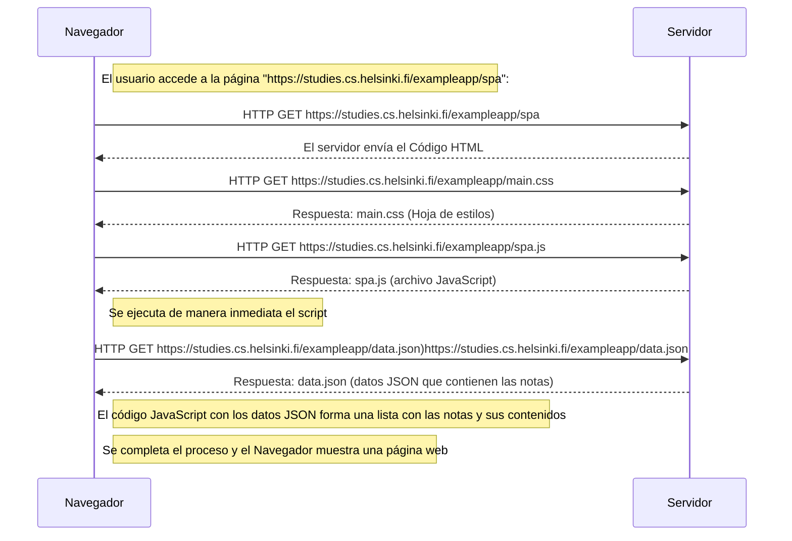

```mermaid
sequenceDiagram
Participant Navegador
Participant Servidor

Note right of Navegador: El usuario accede a la página "https://studies.cs.helsinki.fi/exampleapp/spa":
Navegador ->>  Servidor: HTTP GET https://studies.cs.helsinki.fi/exampleapp/spa
Servidor -->> Navegador: El servidor envía el Código HTML
Navegador ->>  Servidor: HTTP GET https://studies.cs.helsinki.fi/exampleapp/main.css
Servidor -->> Navegador: Respuesta: main.css (Hoja de estilos)
Navegador ->>  Servidor:  HTTP GET https://studies.cs.helsinki.fi/exampleapp/spa.js
Servidor -->> Navegador: Respuesta: spa.js (archivo JavaScript)
Note right of Navegador: Se ejecuta de manera inmediata el script

Navegador ->>  Servidor: HTTP GET https://studies.cs.helsinki.fi/exampleapp/data.json)https://studies.cs.helsinki.fi/exampleapp/data.json
Servidor -->> Navegador: Respuesta: data.json (datos JSON que contienen las notas)
Note right of Navegador: El código JavaScript con los datos JSON forma una lista con las notas y sus contenidos


Note right of Navegador: Se completa el proceso y el Navegador muestra una página web

```
